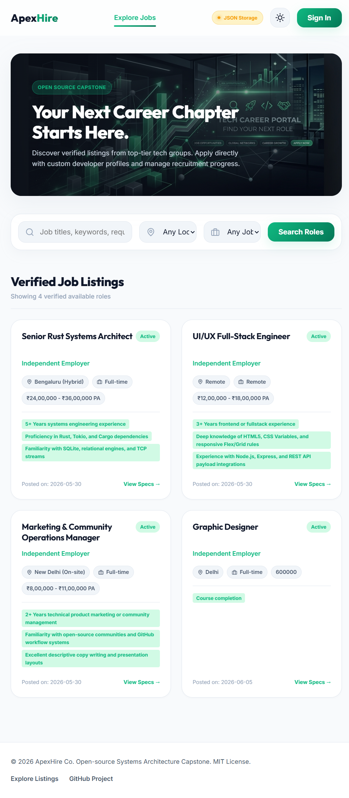

# ApexHire

## Overview

ApexHire is a full-stack job portal built with Node.js, Express, MongoDB, and JavaScript. Job seekers can find roles and track applications, while employers can publish listings and review candidates. MongoDB is supported through Mongoose; when MongoDB is not configured, the app uses a local JSON file for development.

## Features

- Search and filter job listings by keyword, location, and job type.
- Register and sign in as a job seeker or employer.
- Maintain a seeker profile and submit applications with a cover letter.
- Create, edit, and delete employer job listings.
- Review candidate applications and update their status.
- Use MongoDB or a local JSON fallback for development.
- Switch the interface between light and dark themes.

## Technology Stack

- JavaScript, HTML, and CSS
- Node.js and Express
- MongoDB and Mongoose
- `cookie-parser` for session cookies
- JSON file storage as a local fallback when MongoDB is unavailable

## Screenshots



## Project Structure

```text
.
├── docs/                 # Browser UI, styles, and static assets
│   └── assets/           # Images used by the interface
├── database.js           # Mongoose models and local JSON fallback
├── server.js             # Express server and REST API
├── package.json          # Dependencies and npm scripts
├── package-lock.json     # Locked dependency versions
├── db_tutorial.md        # MongoDB Atlas setup notes
└── README.md
```

`database.json` is created locally when the JSON fallback is used. It can contain account details, profile data, applications, and password hashes, so it is intentionally excluded from Git. `jobs_output.json` is generated by `get_jobs.ps1` and is also excluded.

## Installation

Install Node.js 20.19 or newer, then install the project dependencies:

```bash
npm install
```

MongoDB is optional for local development. To use MongoDB, set `MONGODB_URI` in a local `.env` file or in the environment. An optional `DEMO_EMPLOYER_PASSWORD` sets the password for the seeded `stellar_corp` demo account; if omitted, a random password is generated and not displayed. Keep real connection strings, passwords, and `.env` files out of version control.

## Running the Application

```bash
npm start
```

Open [http://localhost:8080](http://localhost:8080). If MongoDB is unavailable, the server falls back to `database.json` in the project directory. On a fresh checkout, that file starts empty; register an employer account and add listings through the site. The existing local database is not needed to run the application.

## API / Backend

The Express server serves the browser app and exposes these JSON endpoints:

| Method | Endpoint | Purpose |
| --- | --- | --- |
| `POST` | `/api/auth/register` | Register a seeker or employer |
| `POST` | `/api/auth/login` | Sign in |
| `POST` | `/api/auth/logout` | Sign out |
| `GET` | `/api/auth/me` | Get the current session user |
| `PUT` | `/api/profile` | Update the signed-in user's profile |
| `GET` | `/api/jobs` | List and filter jobs |
| `GET` | `/api/jobs/:id` | Get a job listing |
| `POST` | `/api/jobs` | Create a listing as an employer |
| `PUT` | `/api/jobs/:id` | Update an employer's listing |
| `DELETE` | `/api/jobs/:id` | Delete an employer's listing |
| `POST` | `/api/jobs/:id/apply` | Apply as a seeker |
| `GET` | `/api/seeker/applications` | List the seeker's applications |
| `GET` | `/api/employer/applications/:jobId` | List candidates for a job |
| `PUT` | `/api/employer/applications/:appId` | Update an application status |
| `GET` | `/api/db-status` | Report the active database mode |

Employer and seeker routes enforce role checks. The current implementation hashes passwords with plain SHA-256; treat this project as a learning/demo app, not production authentication. A production deployment should use a password-hashing algorithm designed for credentials, such as Argon2id or bcrypt.

## What I Learned

Building ApexHire gave me practice connecting an Express REST API to a browser interface, organizing job-seeker and employer workflows, and enforcing role checks on protected routes. I also worked with Mongoose models and a local JSON fallback so the app can be tried without a running MongoDB service. The authentication code is a useful reminder that a working login flow still needs production-grade password hashing before deployment.